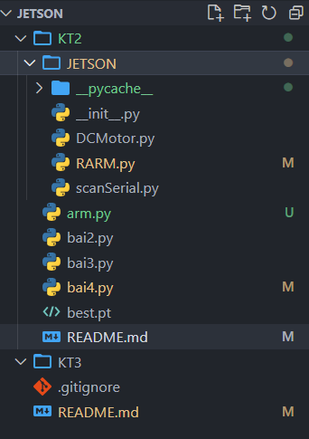

# KT2

## Bài 1

- Cài đặt hệ điều hành
- Cài đặt thư viện cần thiết
- Nhận dạng được đối tượng

## Bài 2

- Nhận diện đối tượng kết hợp với điều khiển LED và động cơ

[Code](./bai2.py)

## Bài 3

- Nhận diện đối tượng và hiển thị lên LCD

[Code](./bai3.py)

## Bài 4

- Nhận diện đối tượng kết hợp với điều khiển cánh tay máy

### 4.1. Hướng dẫn sử dụng package JETSON

#### 4.1.1. Sử dụng package RARM 



> Để folder cùng cấp với file arm.py
> Trong file armp.py(đổi tên khác cũng được)

```python
#khai báo package dấn tới file RARM.py
# import JETSON.RARM 
from JETSON.RARM import RARM

channels = ['9', '12', '17', '21', '24', '28'] # khai báo các channel từ khâu nối giá tới điểm cuối chấp hành
arm = RARM(port = 'COM13') 
# COM13 là port trong windows
# ko khai báo port là mặc định là '/dev/ttyACM0'
# arm = RARM() # khai báo trong jetson

while True:
    # xét bị trí từ khau nối giá tới điểm cuối chấp hành
    arm.setPos([1765, 2214, 1520, 2133, 1482, 1765])
    sleep(2)
    arm.setPos([2050, 2050, 1153, 2133, 1480, 1357])
    sleep(2)
    arm.setPos([1520, 2255, 745, 2010, 1480, 1600])
    sleep(2)
    arm.setPos([1031, 1806, 1398, 2133, 1480, 1888])
    sleep(2)
```