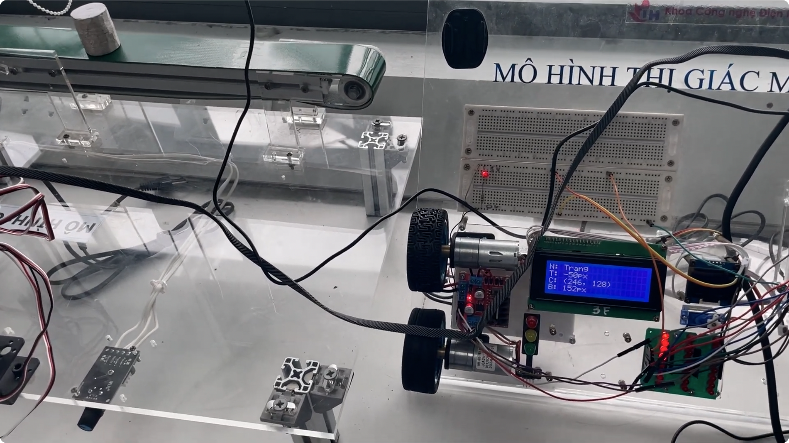
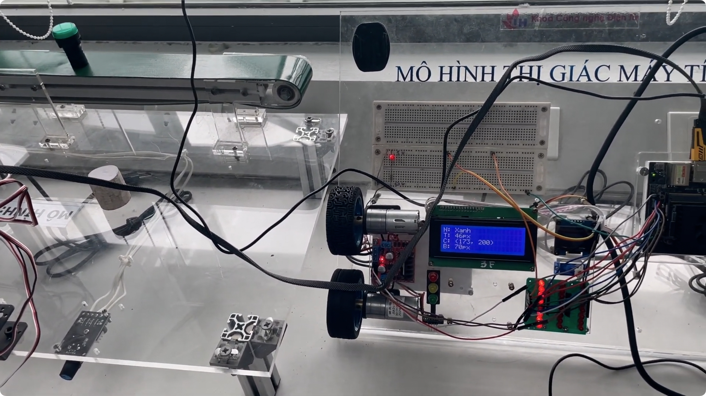
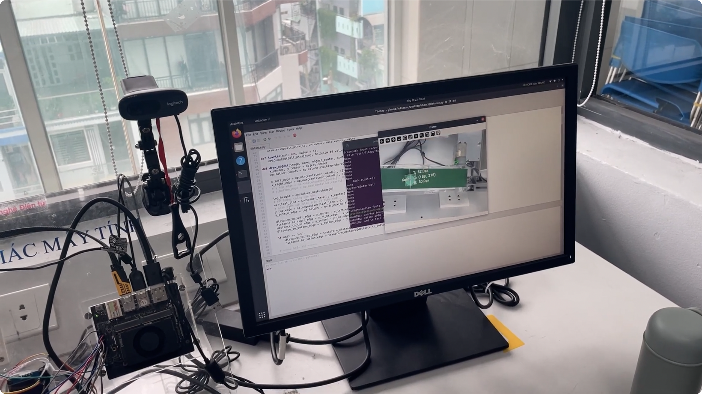
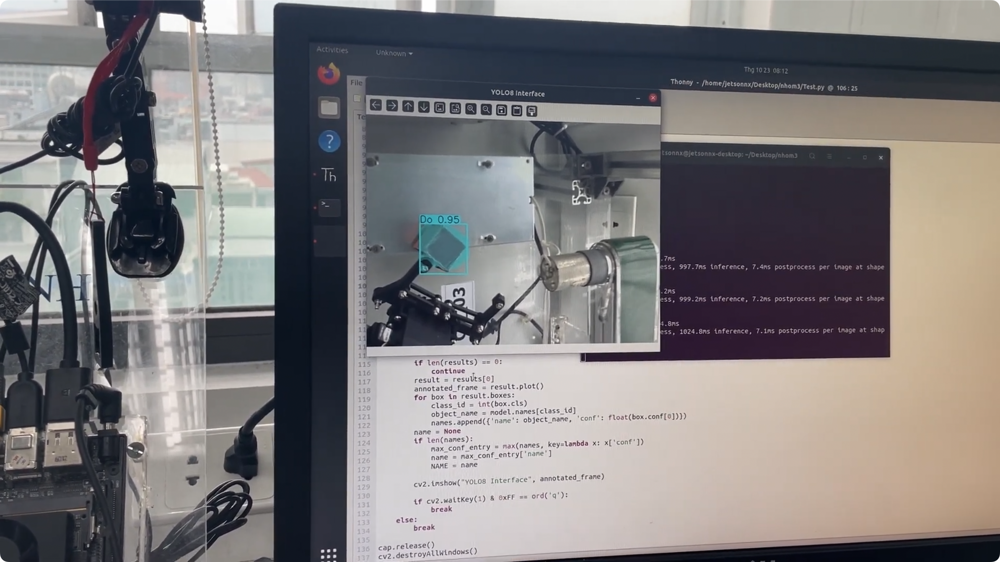

# Project 2

Dùng yolo segmentation trên JETSON kết hợp với các thiết bị ngoại vi

[Youtube video](https://youtu.be/TVd_zjjFXlM)

## Bài 1

Tính khoảng cách từ tâm vật thể đến 2 mép băng tải

## Bài 2

Nhận diện 3 vật thể và điểu khiển cánh tay máy gắp vật thể đặt tại vị trí tương ứng

