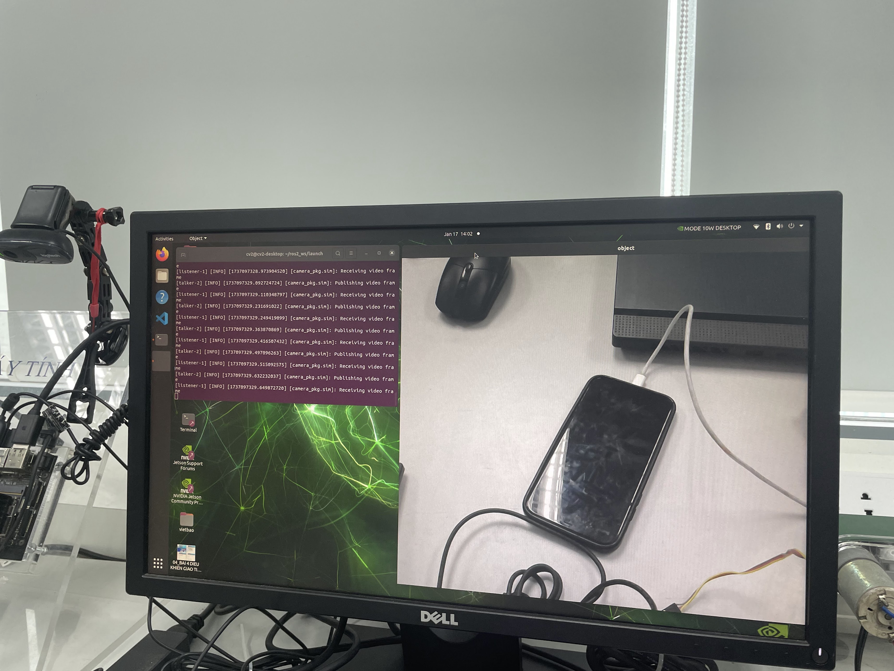
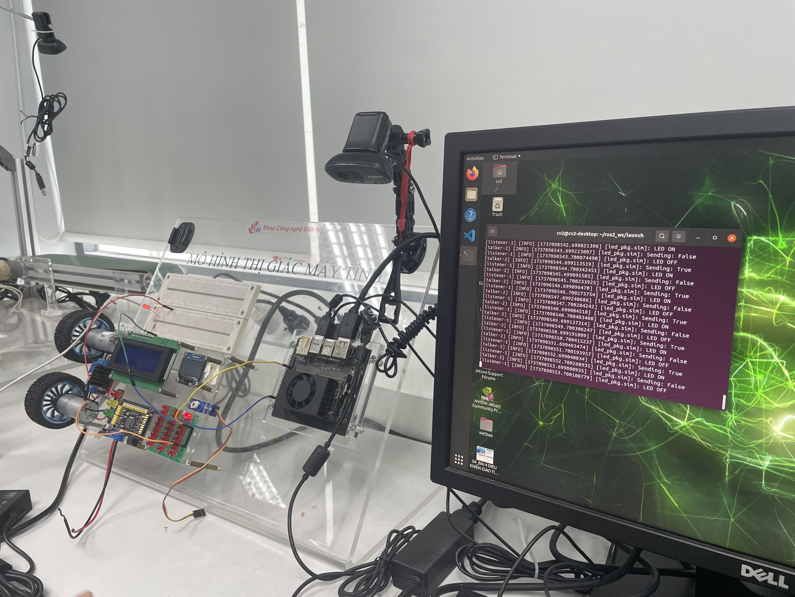
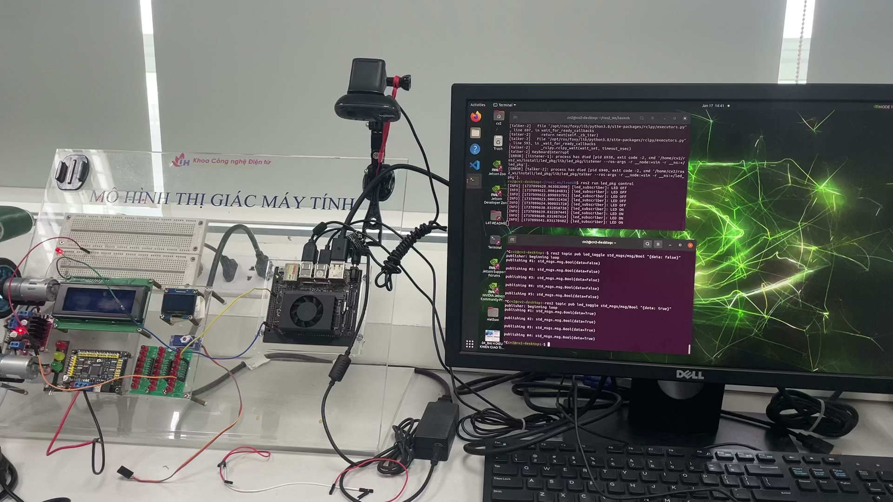
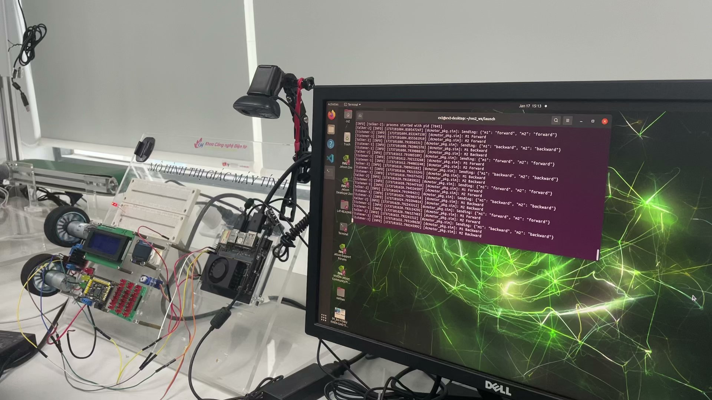
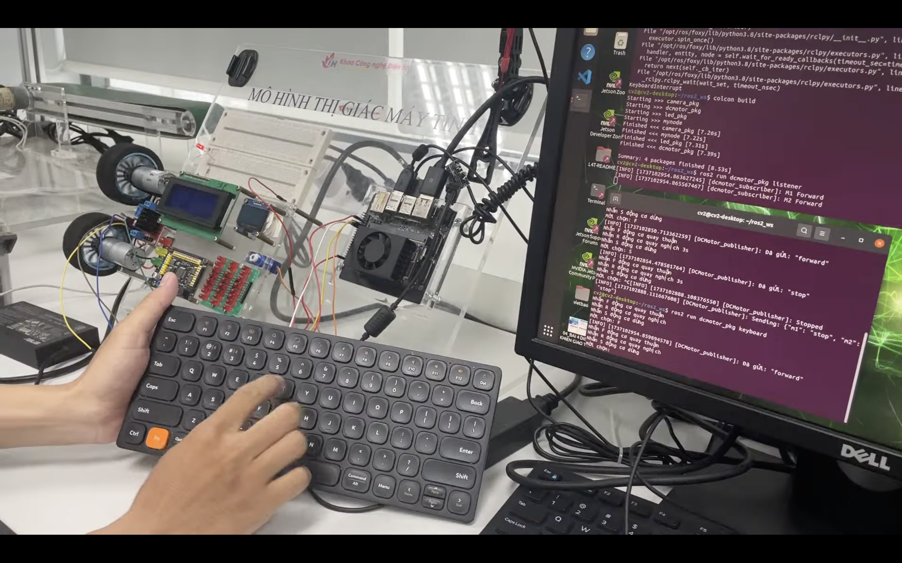

## [camera_pkg](./camera_pkg/)

Truyền hình ảnh thông qua pub-sub



## [led_pkg](./led_pkg/)

Gửi lệnh điều khiển toggle LED mỗi 1s



Có thể gửi lệnh điều khiển trực tiếp từ terminal

```bash
ros2 topic pub led_toggle std_msgs/msg/Bool "{data: true}"
```

```bash
ros2 topic pub led_toggle std_msgs/msg/Bool "{data: false}"
```



## [dcmotor_pkg](./dcmotor_pkg/)

Điều khiển động cơ thông qua module L298N

### Node `listener` (`sub.py`)

Nhận tín hiệu điều khiển và điều khiển động cơ theo dạng JSON

```json
{
    "m1": "forward|backward|stop",
    "m2": "forward|backward|stop"
}
```

Khởi tạo class với các chân điều khiển L298N (theo board)

```python
# Khởi tạo với 4 chân điều khiển chiều, không dùng PWM
DCMotorSubscriber(7, 11, 12, 13)
```

### Node `talker` (`pub.py`)

Gửi tín hiệu điều khiển 2 động cơ mỗi 3s lần lượt: quay thuận, quay nghịch, dừng



### Node `keyboard` (`pub_kb.py`)

Gửi tín hiệu điều khiển 2 động cơ từ bàn phím

- Nhấn F động cơ quay thuận
- Nhấn R động cơ quay nghịch
- Nhấn S động cơ dừng

